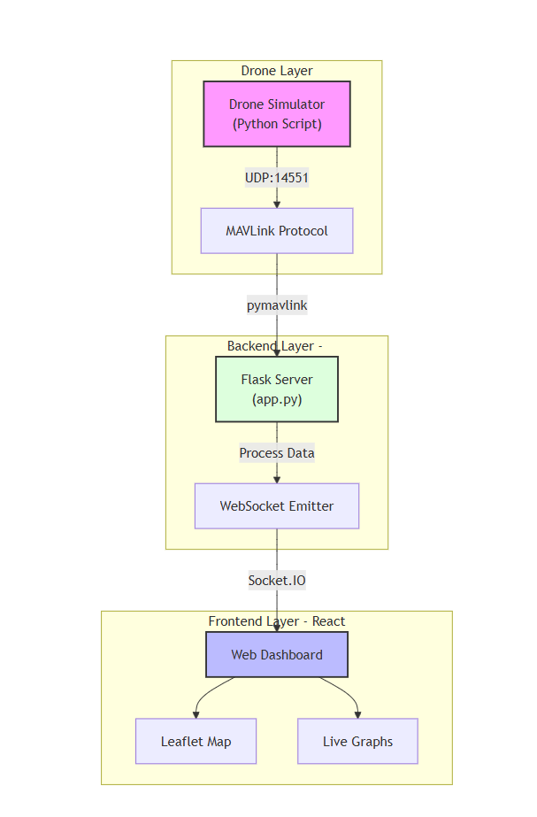
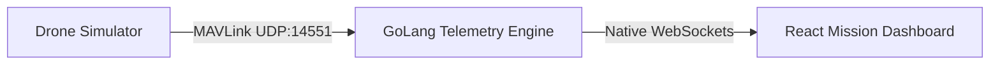

# 🛰️ VyomGarud: Sentinel-X1 Ground Control System (GCS)

A **military-grade, cloud-capable Ground Control Station** developed for the **VyomGarud Round 3 Technical Challenge**.

This system visualizes real-time telemetry from UAVs using the **MAVLink** protocol. It features a **Dual-Architecture Backend** (Python Prototype + **GoLang High-Performance Engine**) to demonstrate scalability for hybrid communication environments (4G/LTE + LoRa).



---

## 🎯 Mission Capabilities

- **High-Performance Telemetry Engine** —  GoLang backend using Goroutines & Native WebSockets for ultra-low latency.
- **Sentinel-X1 Telemetry** — Decodes MAVLink v2.0 packets: Attitude, GPS, Battery, Speed, and Altitude.
- **Tactical Map Tracking** — Real-time UAV geolocation on Leaflet with animated drone markers.
- **Flight Analytics Dashboard** — Live graphs for altitude & ground speed at **10Hz refresh**.
- **Hybrid Link Simulation** — UDP-based flight simulator generating precise loiter patterns over Bangalore.

---

## 🛠 Tech Stack

| Layer | Technologies |
|--------|--------------|
| **Frontend** | React, Vite, Leaflet Maps, Recharts, Native WebSockets |
| **Backend (Production)** | **Go (Golang)**, Goroutines, `net/http`, `gorilla/websocket` |
| **Backend (Prototype)** | Python, Flask, PyMAVLink, Flask-SocketIO |
| **Protocols** | UDP (MAVLink v2.0), WebSockets (Real-Time JSON) |

---

## 📁 System Structure

```text
/go-telemetry-server        # [NEW] High-Performance Go Backend
  ├── main.go               # Telemetry Engine (UDP -> WebSocket)
  └── go.mod                # Go dependencies

/backend                    # Python Prototype & Simulator
  ├── app.py                # Legacy Flask Server
  ├── simulator.py          # Sentinel-X1 Flight Simulator
  └── requirements.txt      # Python dependencies

/frontend                   # Mission Control Dashboard
  ├── src/                  # UI + Maps + Charts
  └── package.json          # Frontend libraries
```

---

## ⚙️ Deployment Instructions

### 🔹 Prerequisites
- Go (Golang) 1.19+
- Python 3.10+
- Node.js + npm

---

## 🚀 Phase 1: Launch the Go Telemetry Engine (Recommended)

This backend **replaces Python Flask** for superior concurrency and performance.

```bash
cd go-telemetry-server
go run main.go
```

**Status:**  
GoLang Engine active on:  
- **WebSocket:** `ws://localhost:5000`  
- **UDP MAVLink:** `udp://0.0.0.0:14551`

---

## 🖥️ Phase 2: Launch Mission Control (Frontend)

```bash
cd frontend
npm install
npm run dev
```

Open GCS Dashboard:  
👉 http://localhost:5173  
Status will show: **"SEARCHING FOR LINK"**

---

## ✈️ Phase 3: Start UAV Flight Simulation (Loiter Flight)

```bash
cd backend
python simulator.py
```

**Result:**  
Dashboard updates to **FLYING (VIA GO)** and drone begins a **loiter pattern over Bangalore** with real-time telemetry and charts.

---

## 🛰 Architecture & Data Flow



---

## ⚡ Why GoLang?

Migrated the backend to GoLang for:

- **Concurrency** — Goroutines process UDP + WebSocket broadcasting in parallel.
- **Performance** — Native WebSockets outperform Socket.IO for high-frequency updates.
- **Scalability** — Architecture ready for multi-drone telemetry & swarm operations.

---

## ⚠️ Troubleshooting

| Issue | Cause | Fix |
|--------|--------|------|
| `"Client not using websocket protocol"` | Frontend using old Socket.IO config | Use latest `App.jsx` with `ws://` WebSocket client |
| Dashboard stuck on **DISCONNECTED** | UDP port 14551 busy | Kill all terminals → Start **Go server → Frontend → Simulator** |

---

## 👨‍💻 Developed By

**Pullela Likhith**  
VyomGarud Recruitment Drive — Round 3 Technical Challenge

